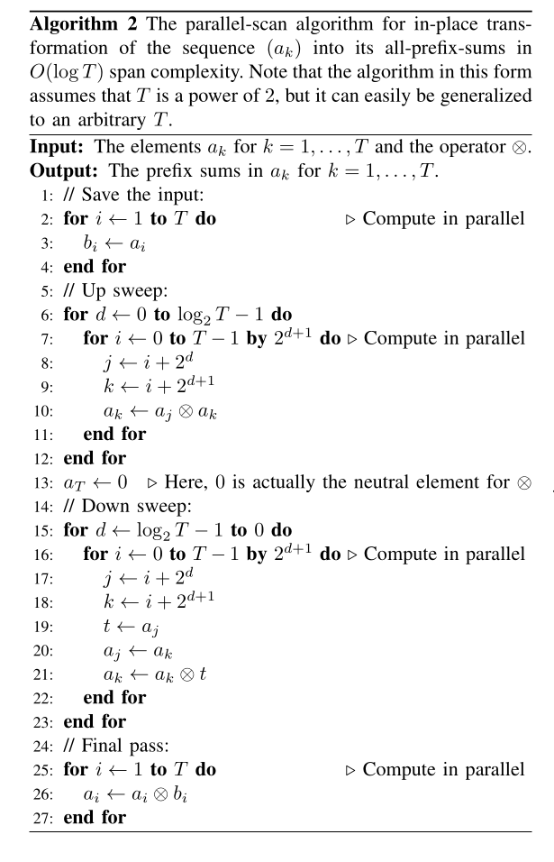

References

[1] S. S. Hassan, S. Särkkä and Á. F. García-Fernández, "Temporal Parallelization of Inference in Hidden Markov Models," in IEEE Transactions on Signal Processing, vol. 69, pp. 4875-4887, 2021, doi: 10.1109/TSP.2021.3103338.